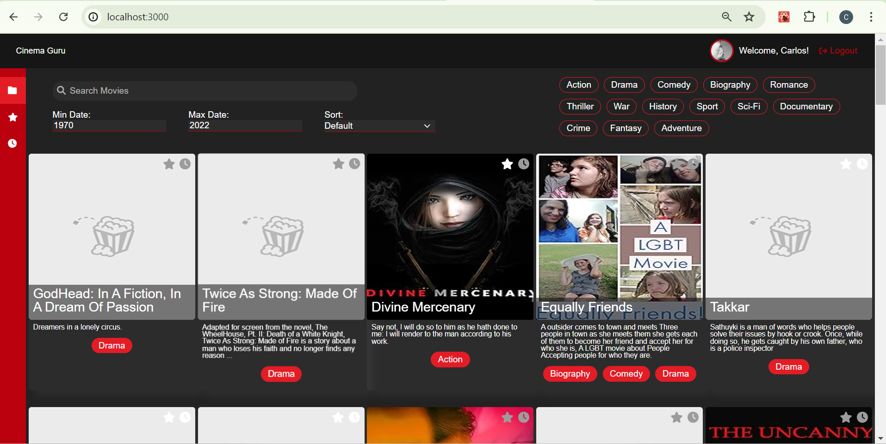

# Implement an app with React

This is a pocket movie app in which we will keep track our favorite movies and set up a watch later list.

## Learning Objectives

- Manage state and props in a react component.
- Use React hooks to achieve certain behavior.
- Implement a design with JSX and CSS (React).
- Implement a frontend app with React.

## Tech Stack:

- Docker
- Yarn
- React
- TypeScript
- Vite

## Requisitos:

1. The <a href="https://www.figma.com/design/x0aU9AfF2yxGqLeUG2RTqE/Holbertonschool---Cinema-Guru-(Copy)?node-id=0-1&t=4eSrMpAHNtHs8jLc-1" title="Figma Design" target="_blank">Figma</a> link contains the main components of the design information details about the project.</li>

2. 
Cloning and running the backend server

<ul>
<li> Clone this <a href="https://github.com/atefMck/holbertonschool-cinema-guru-API" title="repository" target="_blank">repository</a> on your local machine </li>
<li> <code>cd</code> into the repository folder and run the following commands:
<ul>
<li> <code>docker-compose build --no-cache --force-rm</code></li>
<li> <code>docker-compose up</code></li>
<li> After running the above command you should start the backend server.
</ul></li>
</ul>

3. You can clone this repository and run yarn dev
<ul>
<li> Clone this <a href="https://github.com/carlalap/atlas-cinema-guru/" title="home repository" target="_blank">repository</a> on your local machine  </li>

<li> <code>cd</code> into the repository folder and run the following commands:
<ul>
<li> <code>yarn dev</code></li>
